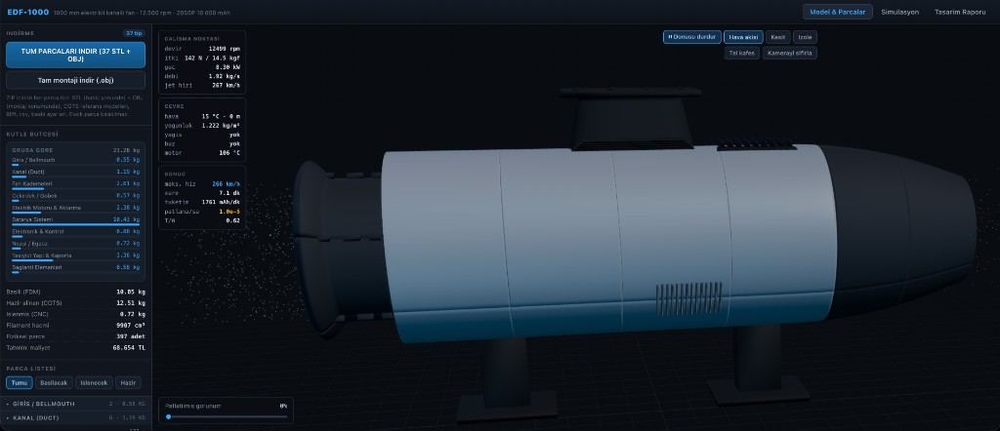
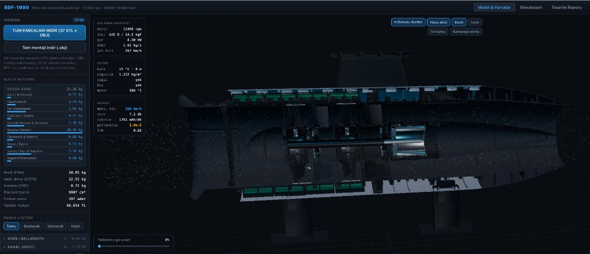
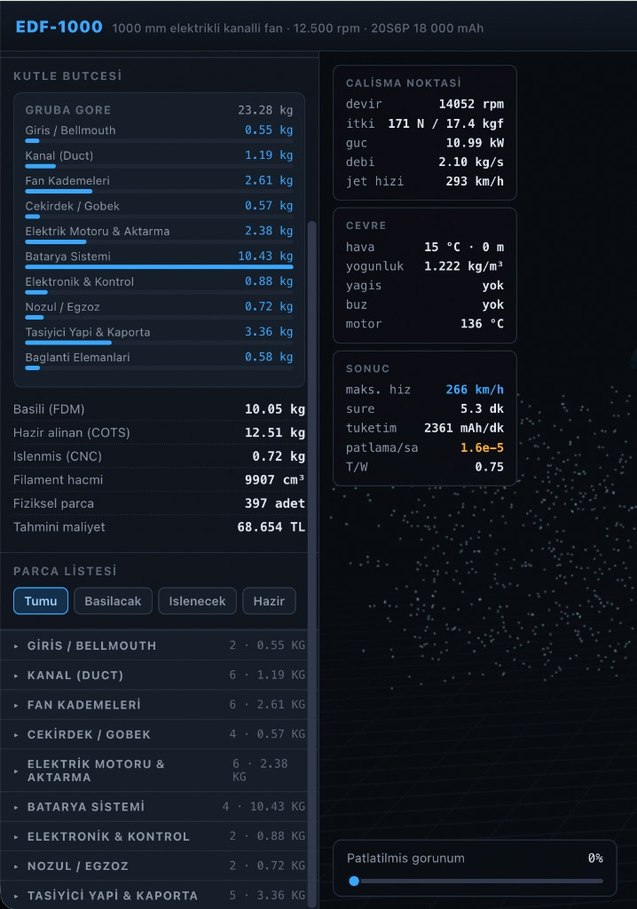

# EDF-1000 — 1 m Elektrikli Kanallı Fan Motoru

Parametrik **3D CAD** + **fizik simülasyonu** web uygulaması.  
1 metre uzunluğunda, iki kademeli elektrikli ducted fan (EDF) tasarımı; tüm parçalar milimetre ölçeğinde üretilebilir, tarayıcıda görüntülenir ve STL/OBJ olarak indirilir.

<<<<<<< HEAD


> **Uyarı:** Deneysel eğitim / bilim projesidir. Havacılık sertifikasyonu yoktur. Rotor ~12 500 rpm; ilk çalıştırmayı koruyucu kafes arkasından yapın. Li-ion pakette BMS zorunludur.

## Ekran görüntüleri

| Model & montaj | Kesit + akış |
|:---:|:---:|
|  |  |



- **Model & Parçalar** — 1:1 3D motor, patlatılmış görünüm, kesit, STL/OBJ indirme  
- **Simülasyon** — çevre senaryoları, itki, batarya, risk HUD’ları  
- **Kütle bütçesi** — grup bazlı kg dağılımı (~23 kg toplam, ~397 fiziksel parça)

=======
> **Uyarı:** Deneysel eğitim / bilim projesidir. Havacılık sertifikasyonu yoktur. Rotor ~12 500 rpm; ilk çalıştırmayı koruyucu kafes arkasından yapın. Li-ion pakette BMS zorunludur.

>>>>>>> ce46df2 (Initial open-source release of EDF-1000.)
## Özellikler

- **1:1 parametrik geometri** — kanal, rotor/stator, mil, yatak, batarya halkası, ESC, nozul
- **Simülasyon** — kış / yağmur / kar / sıcak / irtifa, kütle yükü, itki, batarya tüketimi, patlama/risk tahmini
- **İndirme** — parça bazlı STL/OBJ veya tüm paket ZIP (+ BOM)
- **Kaynakça** — açık erişimli makalelere dayalı tasarım gerekçesi (`src/engine/references.ts`)

## Hızlı başlangıç

```bash
npm install
npm run dev
```

Tarayıcıda `http://localhost:5173` açılır.

```bash
npm run build    # üretim derlemesi
npm run report   # konsol tasarım raporu (opsiyonel)
```

## Teknik özet

| Parametre | Değer |
|-----------|--------|
| Toplam uzunluk | 1000 mm |
| Fan uç çapı | ~198 mm |
| Tasarım devri | 12 500 rpm |
| Batarya | 20S6P 21700 → **18 000 mAh** @ 72 V (~1296 Wh) |
| Statik itki (ISA) | ~174 N |
<<<<<<< HEAD
| Toplam kütle (tipik) | ~23 kg |
=======
>>>>>>> ce46df2 (Initial open-source release of EDF-1000.)

Tek doğruluk kaynağı: [`src/engine/spec.ts`](src/engine/spec.ts).

## Lisans

MIT — bkz. [LICENSE](LICENSE).

Bilimsel kaynaklar proje içi referans listesinde DOI’leriyle anılır; makale telif hakları kendi yayıncılarına aittir.
